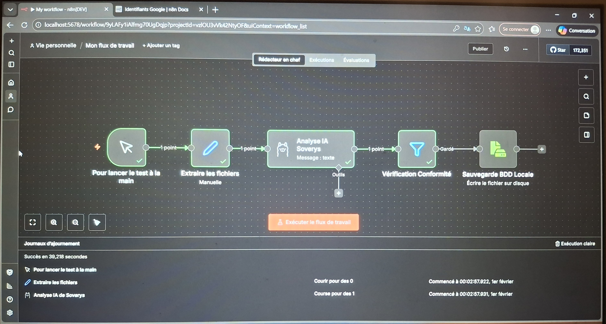

# Soverys-Workflows
Exemple de cas d'usage pour résoudre des problèmes de métiers

# ⚙️ Soverys Workflows : L'intelligence en action

Ce dépôt contient les architectures de flux (workflows) développées sur **n8n**. Ces scénarios sont conçus pour être importés directement dans l'infrastructure Soverys.

## 📂 Workflow Phare : Analyseur de Documents Juridiques / RH
Ce flux automatise la lecture, le tri et l'extraction d'informations sensibles à l'aide d'une IA locale.

### 🔄 Schéma du Flux (Logic) :
1.  **Entrée (Trigger) :** Surveillance d'un dossier sécurisé ou d'une boîte mail chiffrée.
2.  **Extraction :** Conversion du PDF en texte brut.
3.  **Intelligence (Ollama Node) :** Envoi du texte au modèle Mistral/Llama avec un "System Prompt" spécifique (ex: "Extrais les clauses de résiliation").
4.  **Vérification :** Analyse de sentiment ou détection d'anomalies.
5.  **Sortie :** Mise à jour d'un tableau de bord (Notion/Airtable) et alerte si une clause est critique.

### 🛠️ Comment utiliser ces flux ?
Chaque fichier `.json` dans ce dépôt peut être importé via la fonction "Import from File" de n8n.

### 📈 Impact Business :
* **Vitesse :** Traitement d'un contrat de 40 pages en moins de 10 secondes.
* **Sécurité :** Zéro donnée transmise à des API tierces (OpenAI/Google).

*

* ---
### 💡 Note sur les versions
Ce workflow est optimisé pour l'infrastructure **Soverys-Full**. Pour les clients utilisant l'offre **Soverys-Light**, une version sans nœud d'IA (remplacée par du Regex ou des filtres simples) est également disponible sur demande.
